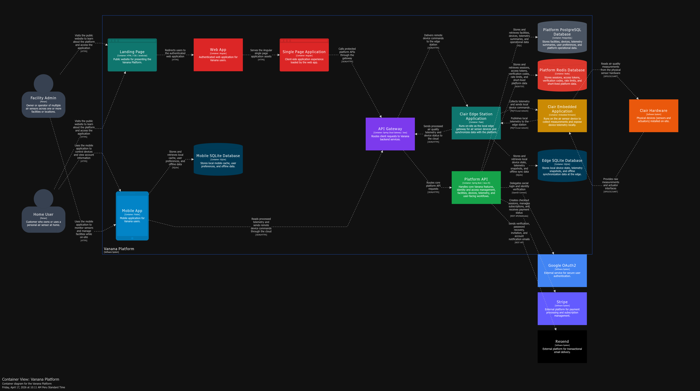
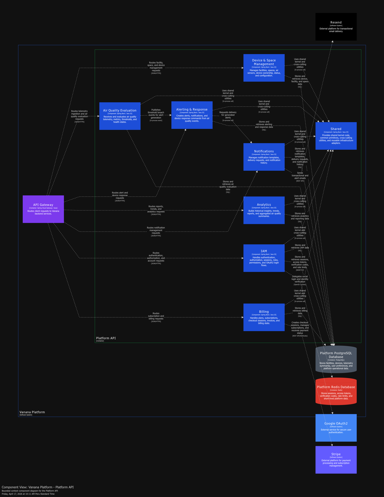
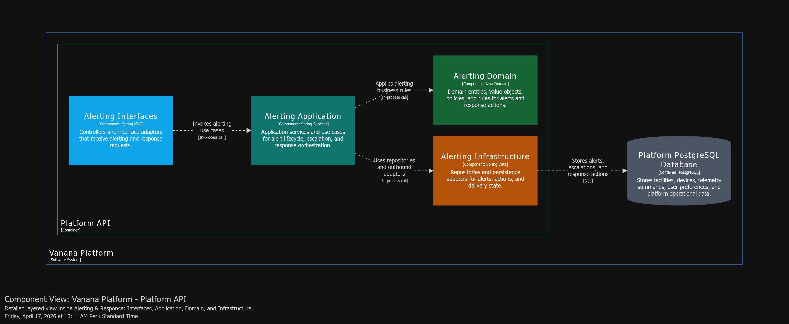
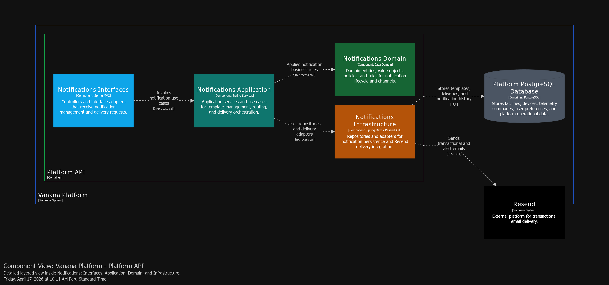
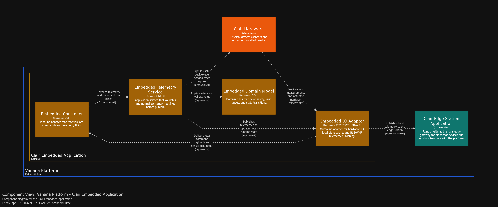
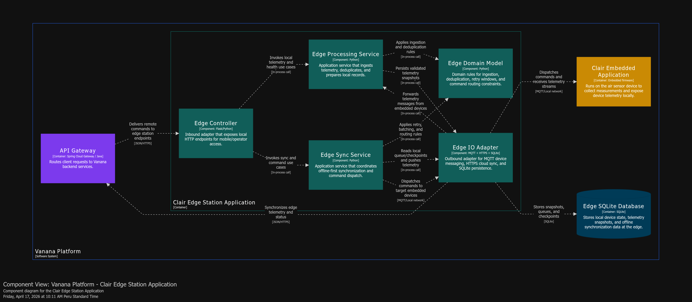

# Vanana C4 Model

This repository contains the C4 model for the Vanana platform.

## Index

- [1. System Context](#1-system-context)
- [2. Containers](#2-containers)
- [3. Platform API Components](#3-platform-api-components)
- [4. IAM Layers](#4-iam-layers)
- [5. Billing Layers](#5-billing-layers)
- [6. Device and Space Layers](#6-device-and-space-layers)
- [7. Air Quality Layers](#7-air-quality-layers)
- [8. Alerting Layers](#8-alerting-layers)
- [9. Analytics Layers](#9-analytics-layers)
- [10. Notifications Layers](#10-notifications-layers)
- [11. Embedded App Components](#11-embedded-app-components)
- [12. Edge Station Components](#12-edge-station-components)

## Diagrams

### 1. System Context

High-level view of the system, users, and external providers.

### 2. Containers

Main distribution of applications, APIs, databases, and edge runtime.

### 3. Platform API Components

Main bounded contexts inside the Platform API.

### 4. IAM Layers

Internal IAM layers: interfaces, application, domain, and infrastructure.

### 5. Billing Layers

Internal Billing layers and integration with Stripe/PostgreSQL.

### 6. Device and Space Layers

Internal layers for facilities, spaces, and device management.

### 7. Air Quality Layers

Internal layers for telemetry evaluation and air quality state.

### 8. Alerting Layers

Internal layers for alerts, escalation, and response actions.

### 9. Analytics Layers

Internal layers for aggregations, trends, and historical reporting.

### 10. Notifications Layers

Internal layers for templates, deliveries, and notification traceability.

### 11. Embedded App Components

Internal components of the sensor device firmware.

### 12. Edge Station Components

Internal components of the edge gateway for local-cloud sync.

