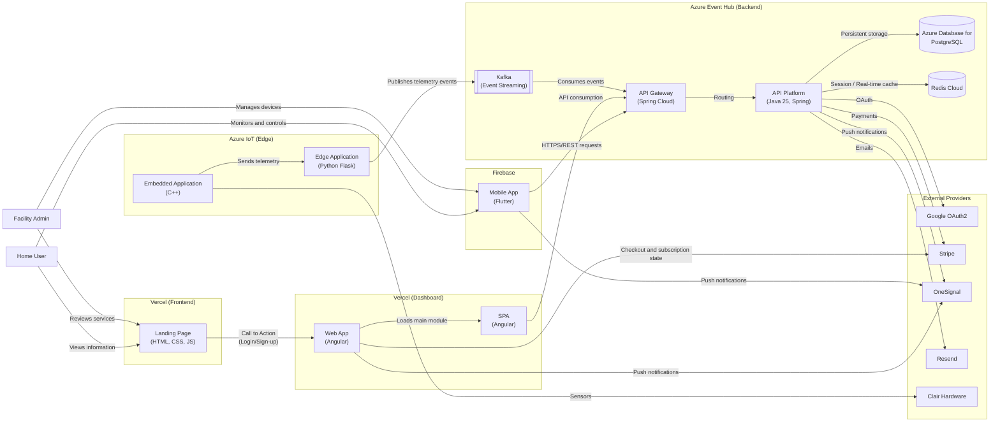

```mermaid
flowchart LR

%% Actors
home["Home User"]
facility["Facility Admin"]

%% Firebase
subgraph firebase["Firebase"]
    mobileapp["Mobile App<br/>(Flutter)"]
end

%% External Providers
subgraph external["External Providers"]
    google["Google OAuth2"]
    stripe["Stripe"]
    onesignal["OneSignal"]
    resend["Resend"]
    hardware["Clair Hardware"]
end

%% Vercel Frontend
subgraph v1["Vercel (Frontend)"]
    landing["Landing Page<br/>(HTML, CSS, JS)"]
end

%% Vercel Dashboard
subgraph v2["Vercel (Dashboard)"]
    webapp["Web App<br/>(Angular)"]
    spa["SPA<br/>(Angular)"]
end

%% Azure Event Hub Backend
subgraph backend["Azure Event Hub (Backend)"]
    gateway["API Gateway<br/>(Spring Cloud)"]
    platform["API Platform<br/>(Java 25, Spring)"]
    kafka[["Kafka<br/>(Event Streaming)"]]
    postgres[("Azure Database for<br/>PostgreSQL")]
    redis[("Redis Cloud")]
end

%% Azure IoT Edge
subgraph edgegroup["Azure IoT (Edge)"]
    embedded["Embedded Application<br/>(C++)"]
    edge["Edge Application<br/>(Python Flask)"]
end

%% User Relationships
home -->|"Monitors and controls"| mobileapp
home -->|"Views information"| landing
facility -->|"Manages devices"| mobileapp
facility -->|"Reviews services"| landing

%% Frontend Flow
landing -->|"Call to Action<br/>(Login/Sign-up)"| webapp
webapp -->|"Loads main module"| spa

%% Mobile & Web Connections
mobileapp -->|"HTTPS/REST requests"| gateway
webapp -->|"Checkout and subscription state"| stripe
webapp -->|"Push notifications"| onesignal
mobileapp -->|"Push notifications"| onesignal
spa -->|"API consumption"| gateway

%% Backend Orchestration
gateway -->|"Routing"| platform
platform -->|"Persistent storage"| postgres
platform -->|"Session / Real-time cache"| redis

%% Event Processing
 edge -->|"Publishes telemetry events"| kafka
 kafka -->|"Consumes events"| gateway

%% External Provider Integrations
platform -->|"OAuth"| google
platform -->|"Payments"| stripe
platform -->|"Push notifications"| onesignal
platform -->|"Emails"| resend
embedded -->|"Sensors"| hardware

%% IoT / Edge Flow
embedded -->|"Sends telemetry"| edge
```
