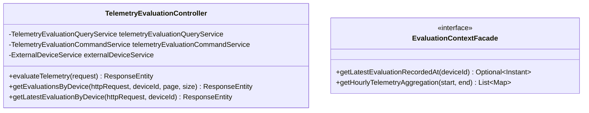
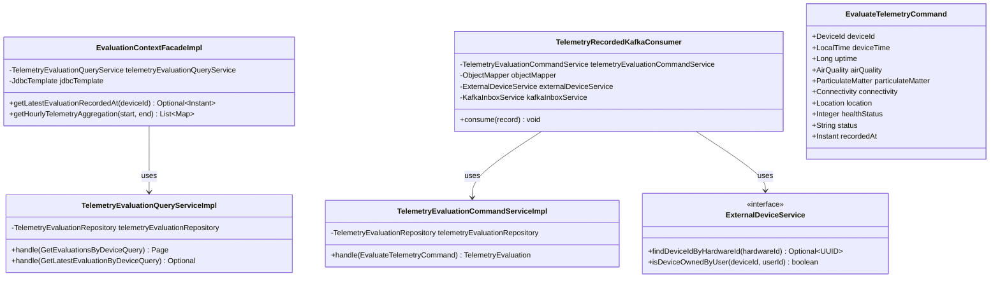
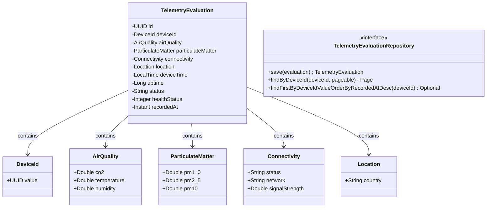
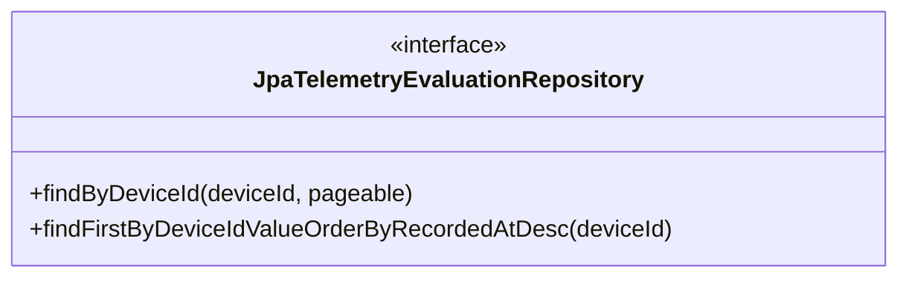

# Evaluation Bounded Context Class Diagrams

This document contains both the unified Bounded Context class diagram and the layered individual diagrams.

## Unified Class Diagram

```mermaid
---
title: DDD Class Diagram - Evaluation Bounded Context (4 Layers)
---

classDiagram

namespace interfaces {
    class TelemetryEvaluationController {
        -TelemetryEvaluationQueryService telemetryEvaluationQueryService
        -TelemetryEvaluationCommandService telemetryEvaluationCommandService
        -ExternalDeviceService externalDeviceService
        +evaluateTelemetry(request) ResponseEntity
        +getEvaluationsByDevice(httpRequest, deviceId, page, size) ResponseEntity
        +getLatestEvaluationByDevice(httpRequest, deviceId) ResponseEntity
    }
    class EvaluationContextFacade {
        <<interface>>
        +getLatestEvaluationRecordedAt(deviceId) Optional~Instant~
        +getHourlyTelemetryAggregation(start, end) List~Map~
    }
}

namespace application {
    class TelemetryEvaluationCommandServiceImpl {
        -TelemetryEvaluationRepository telemetryEvaluationRepository
        +handle(EvaluateTelemetryCommand) TelemetryEvaluation
    }
    class TelemetryEvaluationQueryServiceImpl {
        -TelemetryEvaluationRepository telemetryEvaluationRepository
        +handle(GetEvaluationsByDeviceQuery) Page
        +handle(GetLatestEvaluationByDeviceQuery) Optional
    }
    class EvaluationContextFacadeImpl {
        -TelemetryEvaluationQueryService telemetryEvaluationQueryService
        -JdbcTemplate jdbcTemplate
        +getLatestEvaluationRecordedAt(deviceId) Optional~Instant~
        +getHourlyTelemetryAggregation(start, end) List~Map~
    }
    class TelemetryRecordedKafkaConsumer {
        -TelemetryEvaluationCommandService telemetryEvaluationCommandService
        -ObjectMapper objectMapper
        -ExternalDeviceService externalDeviceService
        -KafkaInboxService kafkaInboxService
        +consume(record) void
    }
    class ExternalDeviceService {
        <<interface>>
        +findDeviceIdByHardwareId(hardwareId) Optional~UUID~
        +isDeviceOwnedByUser(deviceId, userId) boolean
    }
    class EvaluateTelemetryCommand {
        +DeviceId deviceId
        +LocalTime deviceTime
        +Long uptime
        +AirQuality airQuality
        +ParticulateMatter particulateMatter
        +Connectivity connectivity
        +Location location
        +Integer healthStatus
        +String status
        +Instant recordedAt
    }
}

namespace domain {
    class TelemetryEvaluation {
        -UUID id
        -DeviceId deviceId
        -AirQuality airQuality
        -ParticulateMatter particulateMatter
        -Connectivity connectivity
        -Location location
        -LocalTime deviceTime
        -Long uptime
        -String status
        -Integer healthStatus
        -Instant recordedAt
    }
    class DeviceId {
        +UUID value
    }
    class AirQuality {
        +Double co2
        +Double temperature
        +Double humidity
    }
    class ParticulateMatter {
        +Double pm1_0
        +Double pm2_5
        +Double pm10
    }
    class Connectivity {
        +String status
        +String network
        +Double signalStrength
    }
    class Location {
        +String country
    }
    class TelemetryEvaluationRepository {
        <<interface>>
        +save(evaluation) TelemetryEvaluation
        +findByDeviceId(deviceId, pageable) Page
        +findFirstByDeviceIdValueOrderByRecordedAtDesc(deviceId) Optional
    }
}

namespace infrastructure {
    class JpaTelemetryEvaluationRepository {
        <<interface>>
        +findByDeviceId(deviceId, pageable)
        +findFirstByDeviceIdValueOrderByRecordedAtDesc(deviceId)
    }
}

TelemetryEvaluationController --> TelemetryEvaluationCommandServiceImpl : uses
TelemetryEvaluationController --> TelemetryEvaluationQueryServiceImpl : uses
TelemetryEvaluationController --> ExternalDeviceService : uses
TelemetryEvaluationController --> EvaluateTelemetryCommand : receives

TelemetryEvaluationCommandServiceImpl --> TelemetryEvaluation : creates/saves
TelemetryEvaluationCommandServiceImpl --> TelemetryEvaluationRepository : uses

TelemetryEvaluationQueryServiceImpl --> TelemetryEvaluationRepository : uses

TelemetryRecordedKafkaConsumer --> TelemetryEvaluationCommandServiceImpl : uses
TelemetryRecordedKafkaConsumer --> ExternalDeviceService : uses

EvaluationContextFacadeImpl ..|> EvaluationContextFacade : implements
EvaluationContextFacadeImpl --> TelemetryEvaluationQueryServiceImpl : uses

TelemetryEvaluation --> DeviceId : contains
TelemetryEvaluation --> AirQuality : contains
TelemetryEvaluation --> ParticulateMatter : contains
TelemetryEvaluation --> Connectivity : contains
TelemetryEvaluation --> Location : contains

JpaTelemetryEvaluationRepository ..|> TelemetryEvaluationRepository : implements
```

---

## Layered Diagrams

### 1. Interfaces Layer

### 2. Application Layer

### 3. Domain Layer

### 4. Infrastructure Layer

