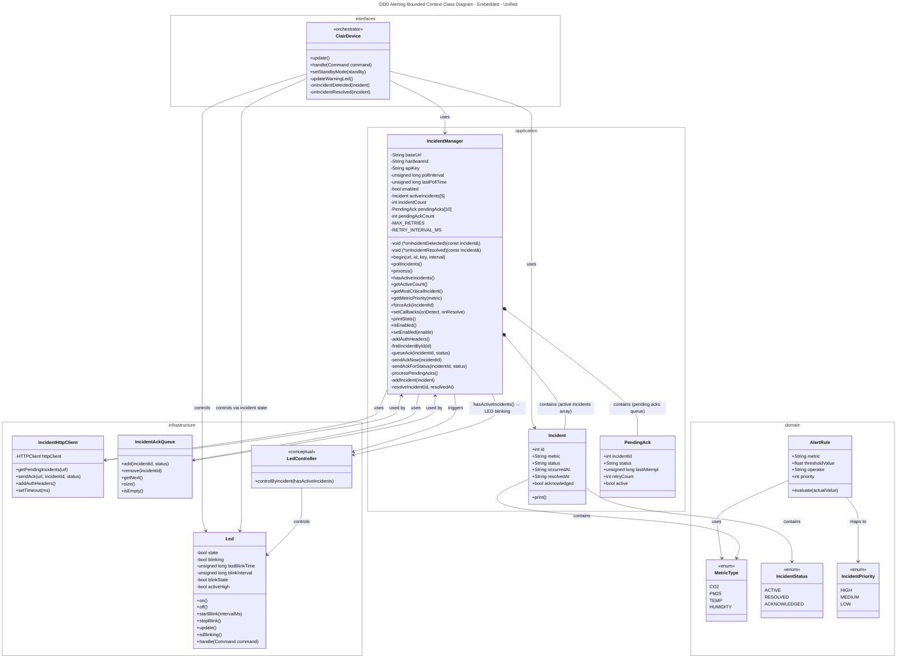
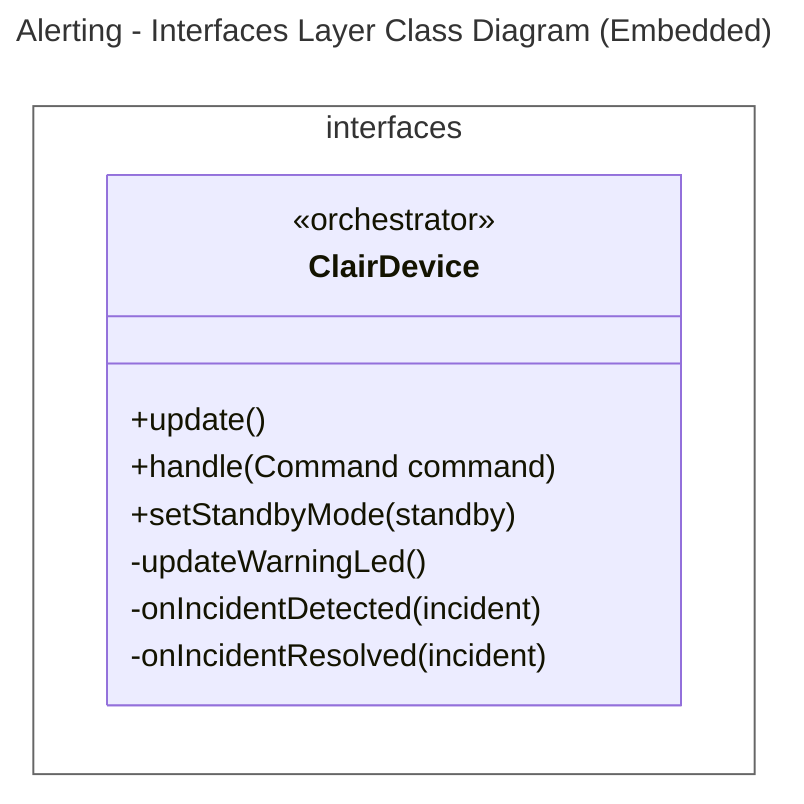
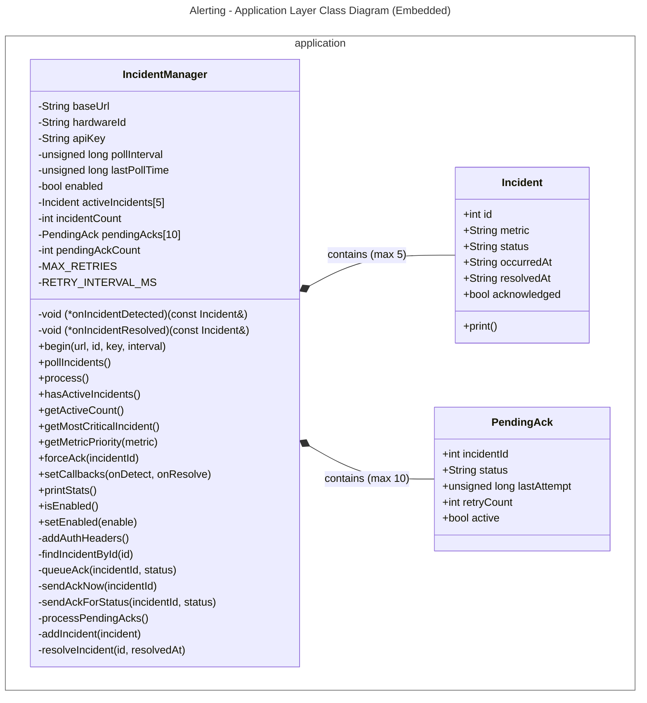
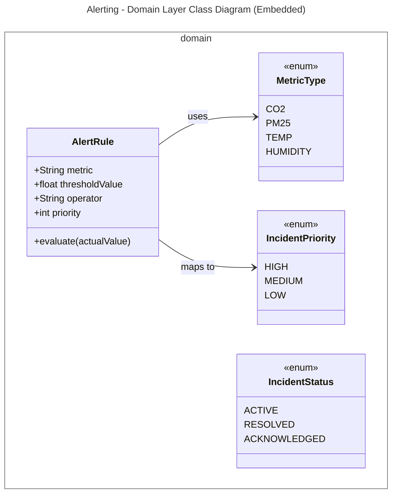
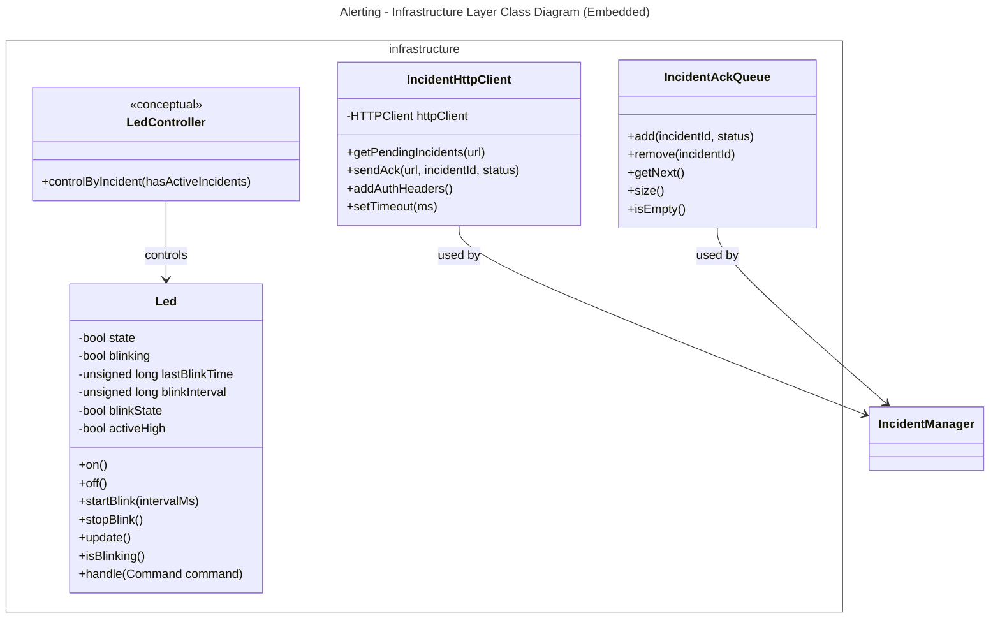
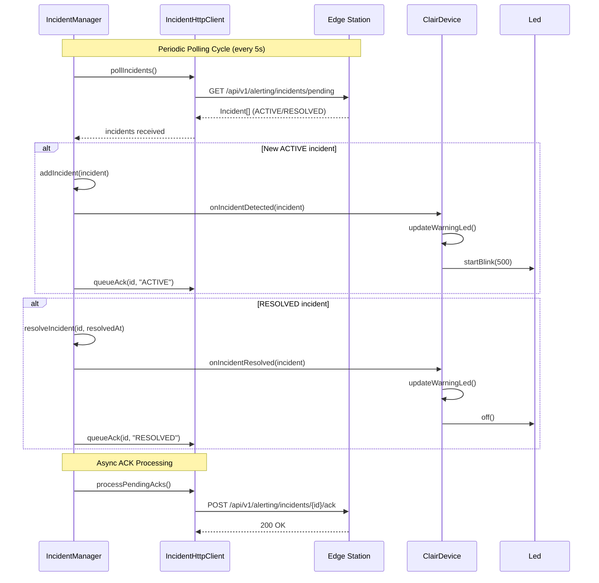
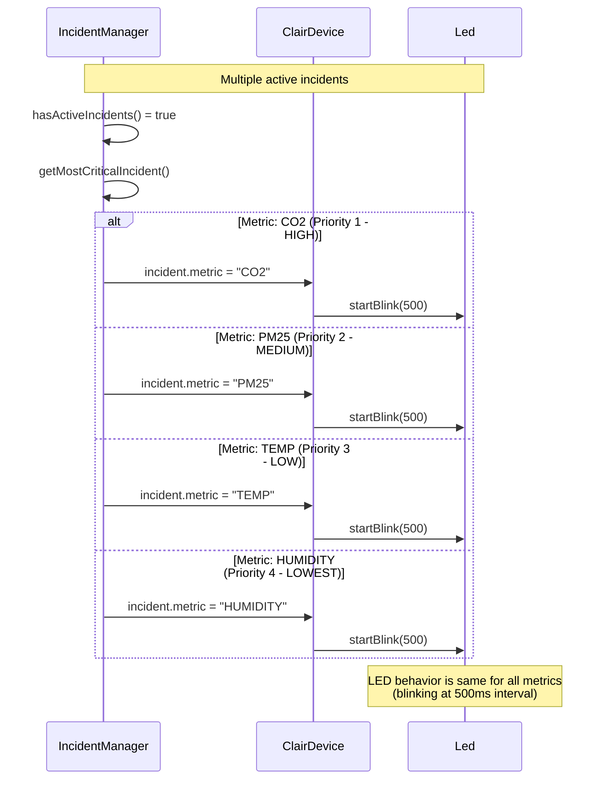

# Alerting Bounded Context Class Diagrams
This document contains the class diagrams of the Alerting Bounded Context in the Embedded application, including the unified view and strictly separated views for each layer (following DDD tactical patterns with ModestIoT framework).

---

## 1. Unified Diagram

## 2. Layer-by-Layer Diagrams

### 2.1. Interfaces Layer

>note for ClairDevice "Main orchestrator that:\n- Initializes IncidentManager\n- Calls updateWarningLed() periodically\n- Controls LED based on hasActiveIncidents()"
---

### 2.2. Application Layer

---

### 2.3. Domain Layer

---

## 2.4. Infrastructure Layer

---

## 3. Key Flows
### 3.1. Incident Polling and LED Control Flow

### 3.2. Incident Priority by Metric Flow

## 4. Incident Types Summary

### 4.1. Incident Metrics and Priority

| Metric | Priority | Description | Typical Threshold |
|--------|----------|-------------|-------------------|
| `CO2` | 1 (HIGH) | Carbon dioxide level too high | > 1500 ppm |
| `PM25` | 2 (MEDIUM) | Particulate matter 2.5 too high | > 55 µg/m³ |
| `TEMP` | 3 (LOW) | Temperature out of range | < 10°C or > 40°C |
| `HUMIDITY` | 4 (LOWEST) | Humidity out of range | < 20% or > 80% |

### 4.2. Incident Status States

| Status | Description | LED Behavior | ACK Required |
|--------|-------------|--------------|--------------|
| `ACTIVE` | Incident is ongoing | Blinking (500ms) | Yes (to Edge) |
| `RESOLVED` | Incident has been resolved | Off | Yes (to Edge) |
| `ACKNOWLEDGED` | Device confirmed receipt | N/A | N/A |

### 4.3. Pending ACK Retry Configuration

| Parameter | Value | Description |
|-----------|-------|-------------|
| `MAX_RETRIES` | 3 | Maximum number of ACK retry attempts |
| `RETRY_INTERVAL_MS` | 5000 | Delay between retry attempts (ms) |
| `MAX_PENDING_ACKS` | 10 | Maximum pending ACKs in queue |

### 4.4. Incident Limits

| Parameter | Value | Description |
|-----------|-------|-------------|
| `MAX_ACTIVE_INCIDENTS` | 5 | Maximum concurrent active incidents stored |
| `MAX_PENDING_ACKS` | 10 | Maximum pending ACKs in queue |
| `DEFAULT_POLL_INTERVAL` | 5000 | Default incident polling interval (ms) |

### 4.5. Metric Priority Mapping

| Priority Level | Metrics | LED Behavior |
|----------------|---------|--------------|
| **HIGH (1)** | `CO2` | Blinking (500ms) |
| **MEDIUM (2)** | `PM25` | Blinking (500ms) |
| **LOW (3)** | `TEMP` | Blinking (500ms) |
| **LOWEST (4)** | `HUMIDITY` | Blinking (500ms) |

> **Note:** LED behavior is identical for all metrics (blinking at 500ms interval). Priority is currently used only for determining the most critical incident when multiple are active.

## 5. Bounded Context Summary

| Layer | Components | Responsibility |
|-------|------------|----------------|
| **Interfaces** | `ClairDevice` | Main orchestrator that initializes IncidentManager, calls updateWarningLed() periodically, and controls LED based on incident state |
| **Application** | `IncidentManager`, `Incident`, `PendingAck` | Polls Edge for incidents, manages active incidents list (max 5), queues ACKs with retry logic (max 3 retries, 5s interval), triggers callbacks on state changes |
| **Domain** | `MetricType` (enum), `IncidentStatus` (enum), `IncidentPriority` (enum), `AlertRule` | Pure abstractions for incident metrics, status states, priority levels, and alert rule evaluation logic |
| **Infrastructure** | `Led`, `IncidentHttpClient`, `IncidentAckQueue`, `LedController` | LED hardware control, HTTP client for Edge communication, ACK queue management, conceptual LED control by incident state |

## 6. Alerting Configuration Constants

| Constant | Value | Description |
|----------|-------|-------------|
| `MAX_ACTIVE_INCIDENTS` | 5 | Maximum number of concurrent active incidents stored |
| `MAX_PENDING_ACKS` | 10 | Maximum pending ACKs in queue |
| `MAX_RETRIES` | 3 | Maximum ACK retry attempts before giving up |
| `RETRY_INTERVAL_MS` | 5000 | Delay between ACK retry attempts (ms) |
| `DEFAULT_POLL_INTERVAL` | 5000 | Default incident polling interval (ms) |
| `LED_BLINK_INTERVAL_MS` | 500 | LED blink interval when incidents active (ms) |
| `INCIDENT_TIMEOUT_MS` | 5000 | HTTP timeout for incident polling (ms) |

## 7. API Endpoints Summary

| Endpoint | Method | Direction | Purpose |
|----------|--------|-----------|---------|
| `/api/v1/alerting/incidents/pending` | GET | Embedded → Edge | Query pending incidents for device |
| `/api/v1/alerting/incidents/{id}/ack` | POST | Embedded → Edge | Acknowledge incident receipt |

