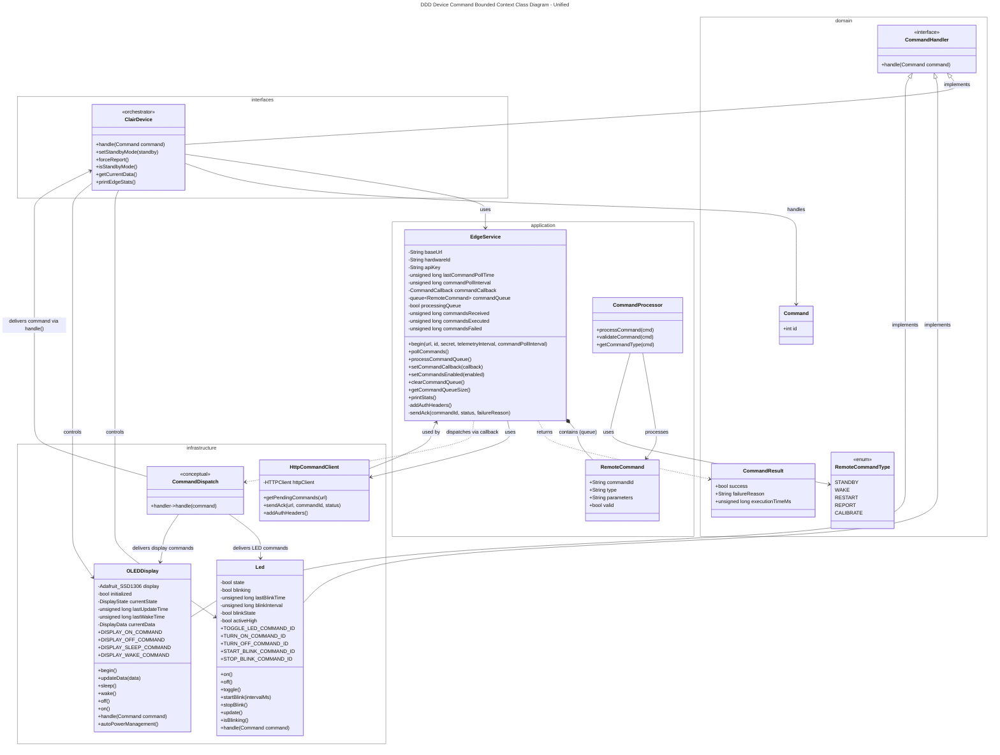
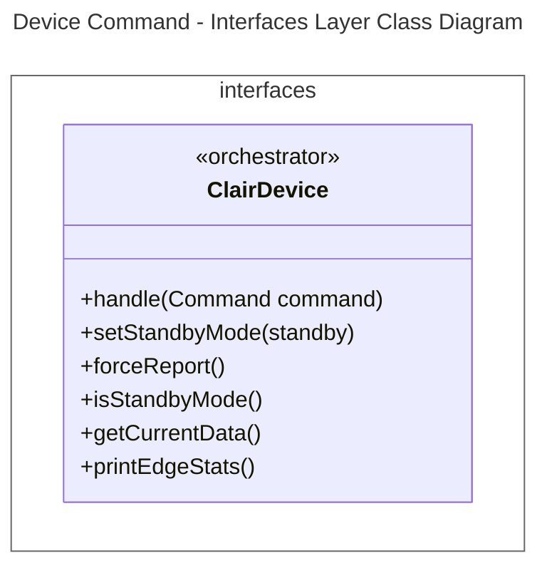
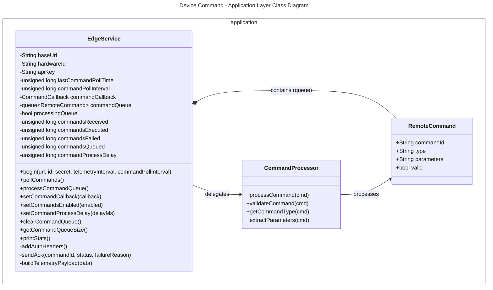
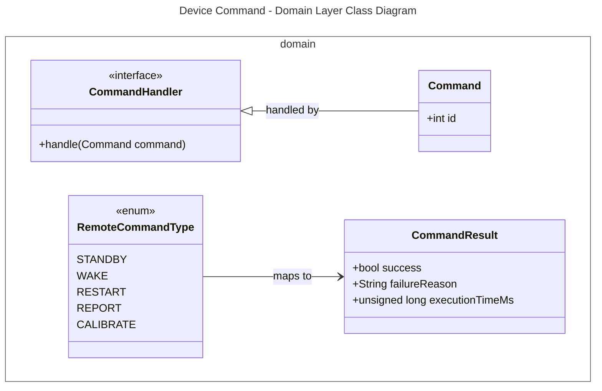
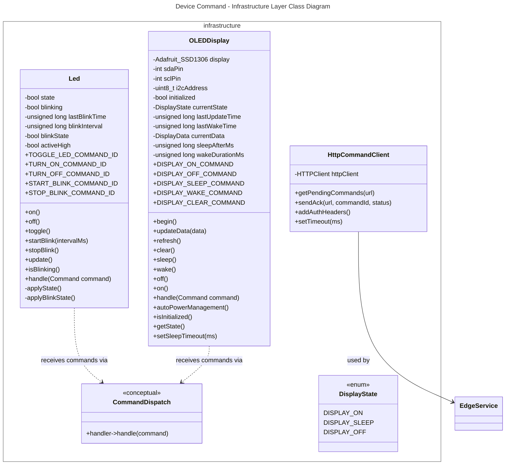
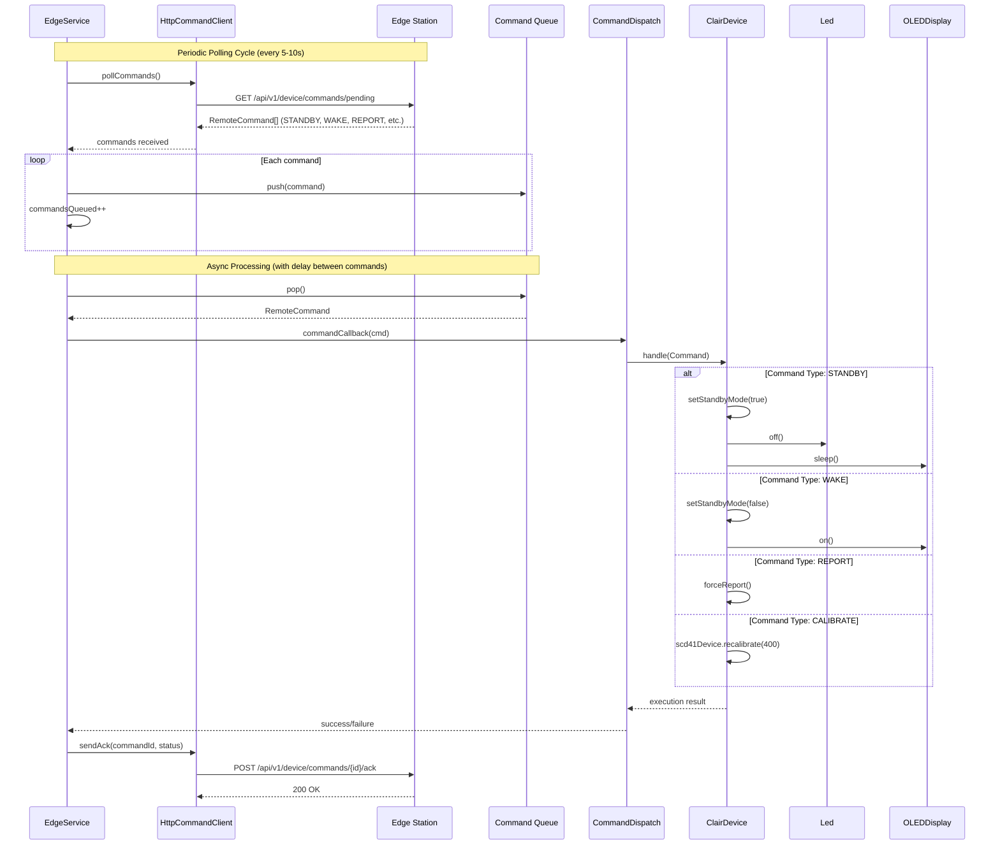
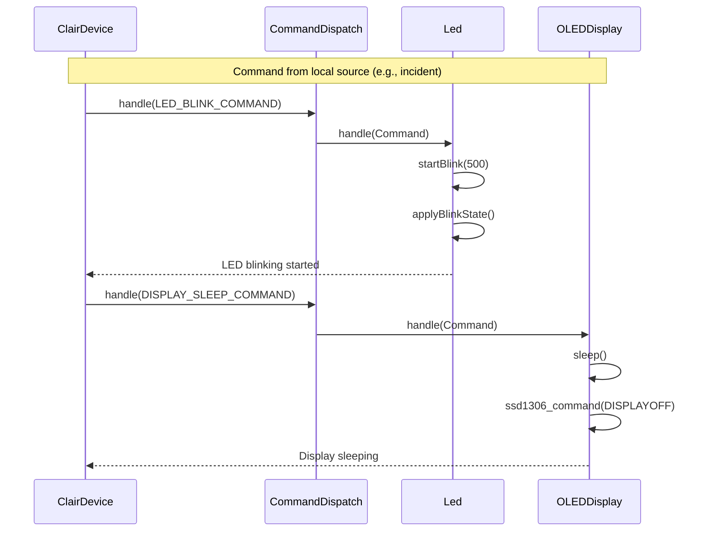

# Device Command Bounded Context Class Diagrams
This document contains the class diagrams of the Device Command Bounded Context in the Embedded application, including the unified view and strictly separated views for each layer (following DDD tactical patterns with ModestIoT framework).

---

## 1. Unified Diagram

## 2. Layer-by-Layer Diagrams

### 2.1. Interfaces Layer

>note for ClairDevice "Main orchestrator implementing\nCommandHandler interface.\nProcesses: STANDBY, WAKE,\nREPORT, CALIBRATE, RESET,\nLED commands, Display commands"
---

### 2.2. Application Layer

---

### 2.3. Domain Layer

---

## 2.4. Infrastructure Layer

---

## 3. Key Flows
### 3.1. Remote Command Polling and Execution Flow

### 3.2. Local Command Flow (LED/Display)

## 4. Command Types Summary

| Command Type | Command ID | Target | Effect |
|--------------|------------|--------|--------|
| `STANDBY` | `REMOTE_STANDBY_COMMAND (2000)` | `ClairDevice` | Suspends non-essential operations, turns off LED/display |
| `WAKE` | `REMOTE_WAKE_COMMAND (2001)` | `ClairDevice` | Resumes normal operation |
| `RESTART` | `REMOTE_RESTART_COMMAND (2002)` | `ClairDevice` | Resets device (TODO) |
| `REPORT` | `CLAIR_REPORT_COMMAND (1000)` | `ClairDevice` | Forces immediate telemetry report |
| `CALIBRATE` | `CLAIR_CALIBRATE_COMMAND (1001)` | `SCD41Sensor` | Performs forced recalibration to 400ppm |
| `RESET` | `CLAIR_RESET_COMMAND (1002)` | `PMS5003Sensor` | Resets PMS5003 sensor |
| `LED_ON` | `LED_ON_COMMAND (3000)` | `Led` | Turns LED on |
| `LED_OFF` | `LED_OFF_COMMAND (3001)` | `Led` | Turns LED off |
| `LED_BLINK` | `LED_BLINK_COMMAND (3002)` | `Led` | Starts LED blinking (500ms interval) |
| `LED_ACKNOWLEDGE_ALL` | `LED_ACKNOWLEDGE_ALL (3003)` | `Led` | Stops blinking after acknowledge |
| `DISPLAY_ON` | `DISPLAY_ON_COMMAND (400)` | `OLEDDisplay` | Turns display on |
| `DISPLAY_OFF` | `DISPLAY_OFF_COMMAND (401)` | `OLEDDisplay` | Turns display off completely |
| `DISPLAY_SLEEP` | `DISPLAY_SLEEP_COMMAND (402)` | `OLEDDisplay` | Puts display in sleep mode |
| `DISPLAY_WAKE` | `DISPLAY_WAKE_COMMAND (403)` | `OLEDDisplay` | Wakes display from sleep |
| `DISPLAY_CLEAR` | `DISPLAY_CLEAR_COMMAND (404)` | `OLEDDisplay` | Clears display |

## 5. Bounded Context Summary

| Layer | Components | Responsibility |
|-------|------------|----------------|
| **Interfaces** | `ClairDevice` | Main orchestrator, implements CommandHandler, processes all command types |
| **Application** | `EdgeService`, `RemoteCommand`, `CommandProcessor` | Polls Edge for commands, manages command queue, dispatches to handlers, sends ACKs |
| **Domain** | `Command`, `CommandHandler`, `RemoteCommandType`, `CommandResult` | Command abstraction, handler interface, command type enumeration |
| **Infrastructure** | `Led`, `OLEDDisplay`, `CommandDispatch`, `HttpCommandClient` | Concrete actuators, HTTP client for Edge communication, conceptual dispatch mechanism |

