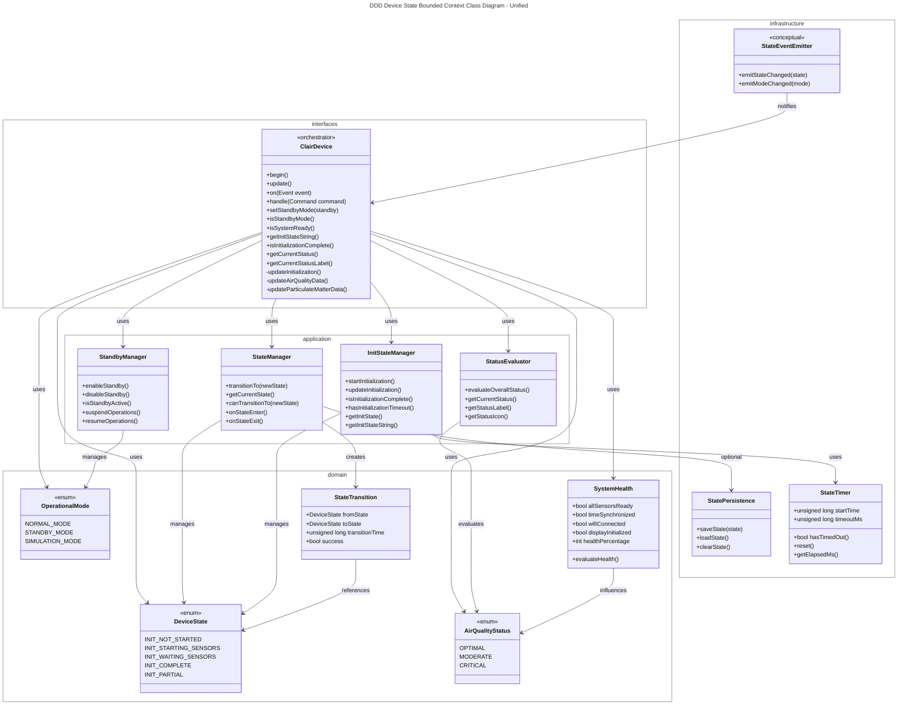
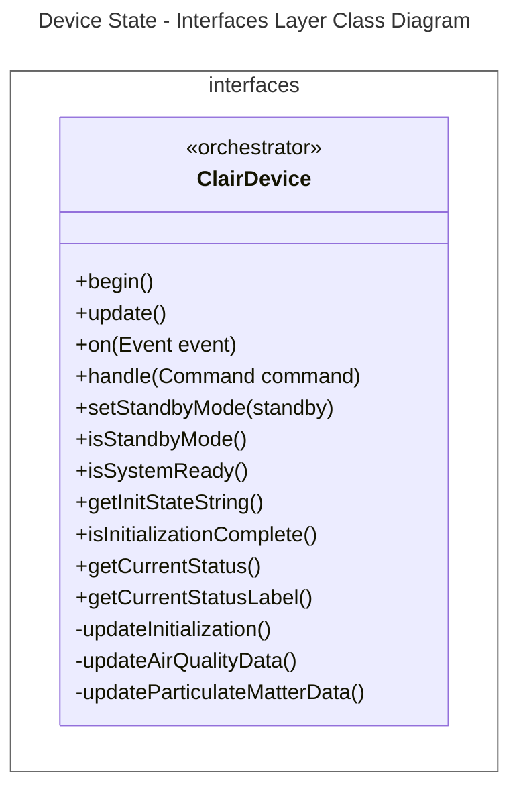
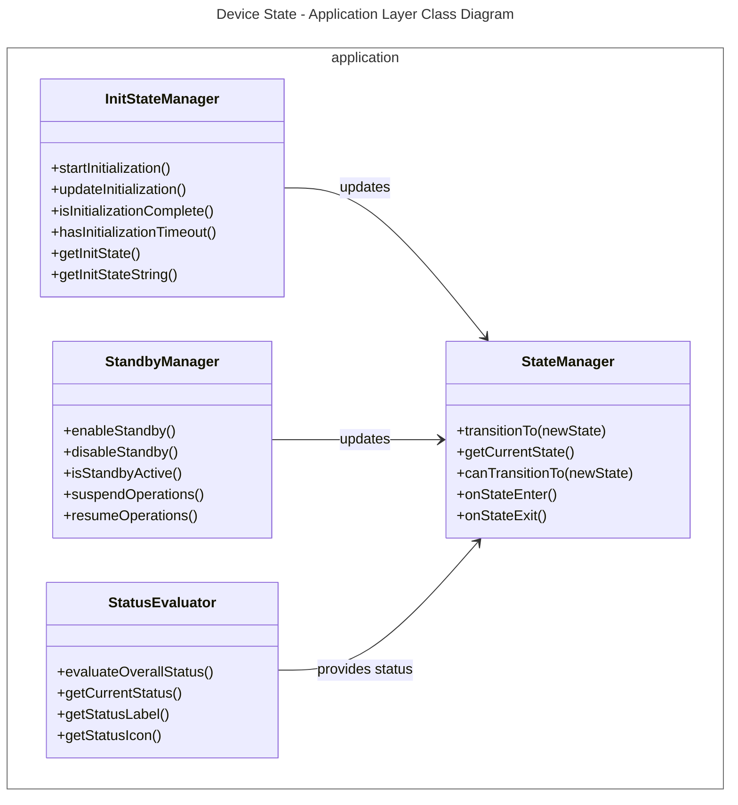
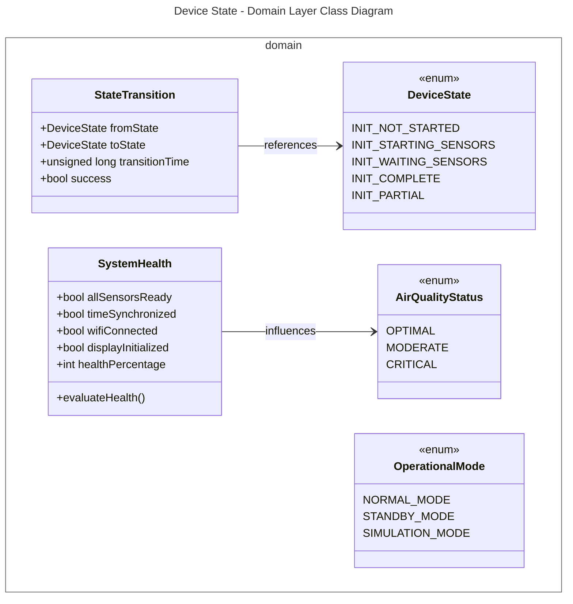
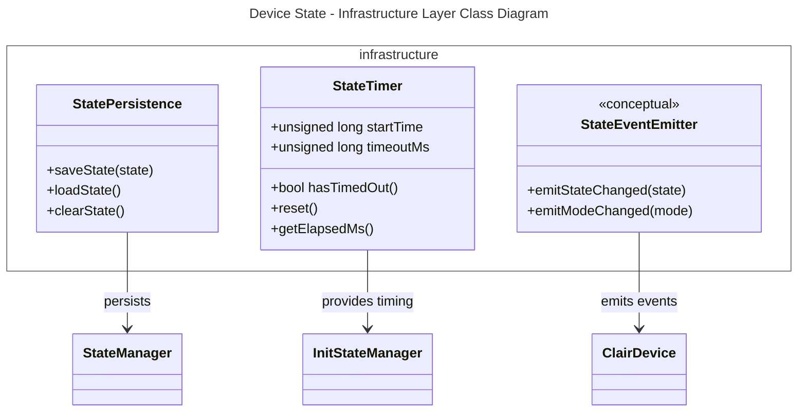
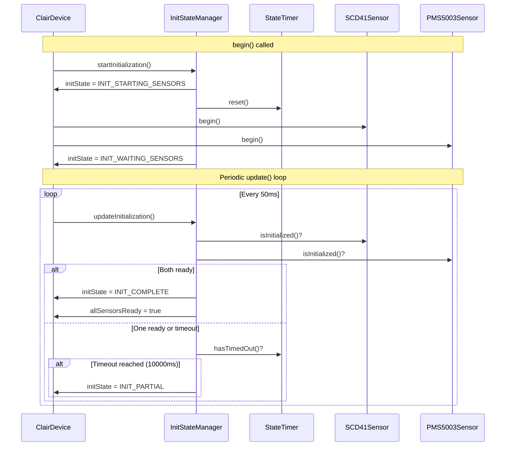
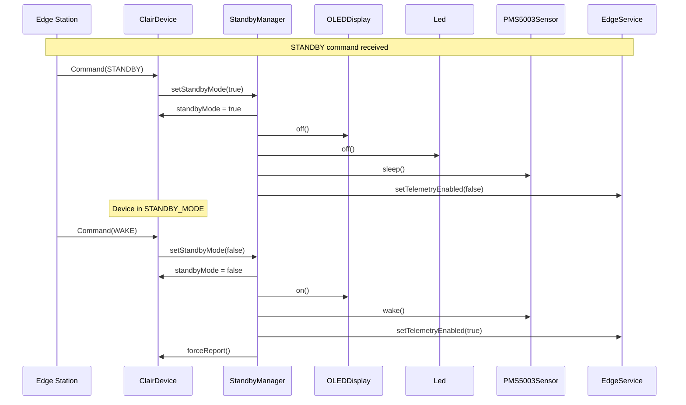
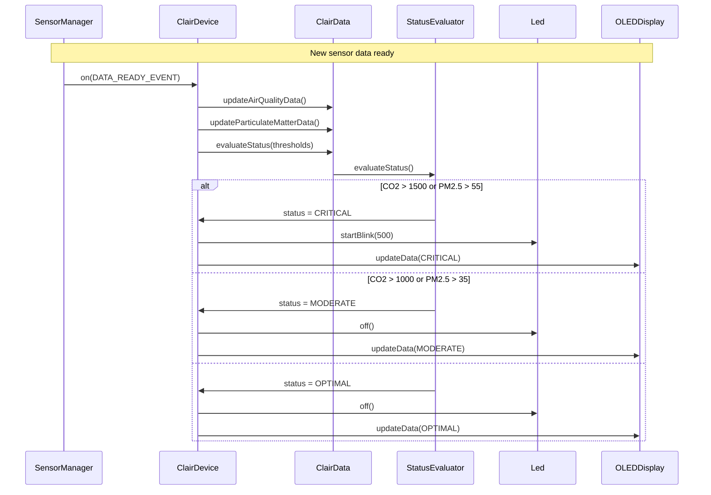

# Device State Bounded Context Class Diagrams
This document contains the class diagrams of the Device State Bounded Context in the Embedded application, including the unified view and strictly separated views for each layer (following DDD tactical patterns with ModestIoT framework).

---

## 1. Unified Diagram

## 2. Layer-by-Layer Diagrams

### 2.1. Interfaces Layer

>note for ClairDevice "Main orchestrator that manages:\n- Initialization state (INIT_NOT_STARTED → STARTING → WAITING → COMPLETE/PARTIAL)\n- Operational mode (NORMAL / STANDBY / SIMULATION)\n- Air quality status (OPTIMAL / MODERATE / CRITICAL)"
---

### 2.2. Application Layer

---

### 2.3. Domain Layer

---

## 2.4. Infrastructure Layer

---

## 3. Key Flows
### 3.1. Device Initialization State Flow

### 3.2. Standby Mode State Flow

### 3.3. Air Quality Status State Flow

## 4. State Types Summary

### 4.1. Device Initialization States

| State | Value | Description | Timeout |
|-------|-------|-------------|---------|
| `INIT_NOT_STARTED` | 0 | Initialization not yet started | N/A |
| `INIT_STARTING_SENSORS` | 1 | Sensors begin() called | N/A |
| `INIT_WAITING_SENSORS` | 2 | Waiting for sensors to initialize | 10000ms |
| `INIT_COMPLETE` | 3 | All sensors initialized successfully | N/A |
| `INIT_PARTIAL` | 4 | Timeout reached, partial initialization | N/A |

### 4.2. Operational Modes

| Mode | Description | Behavior |
|------|-------------|----------|
| `NORMAL_MODE` | Full operation | All sensors active, telemetry sending, display on |
| `STANDBY_MODE` | Low power mode | Sensors sleep, telemetry disabled, display off, LED off |
| `SIMULATION_MODE` | Test mode | Synthetic data generation, no hardware reads |

### 4.3. Air Quality Status States

| Status | Label | Condition | LED Behavior |
|--------|-------|-----------|--------------|
| `OPTIMAL` | "Optimal" | All parameters within optimal ranges | Off |
| `MODERATE` | "Moderate" | One or more parameters in moderate range | Off |
| `CRITICAL` | "Critical" | One or more parameters in critical range | Blinking (500ms) |

### 4.4. State Transition Matrix

| From State | Event | To State | Action |
|------------|-------|----------|--------|
| INIT_NOT_STARTED | `begin()` | INIT_STARTING_SENSORS | Start sensor initialization |
| INIT_STARTING_SENSORS | sensors begin() called | INIT_WAITING_SENSORS | Wait for ready flag |
| INIT_WAITING_SENSORS | both sensors ready | INIT_COMPLETE | Enable normal operation |
| INIT_WAITING_SENSORS | timeout (10s) | INIT_PARTIAL | Continue with partial data |
| NORMAL_MODE | `STANDBY` command | STANDBY_MODE | Suspend operations |
| STANDBY_MODE | `WAKE` command | NORMAL_MODE | Resume operations |
| NORMAL_MODE | `setSimulationEnabled(true)` | SIMULATION_MODE | Generate fake data |
| SIMULATION_MODE | `setSimulationEnabled(false)` | NORMAL_MODE | Read real sensors |

## 5. Bounded Context Summary

| Layer | Components | Responsibility |
|-------|------------|----------------|
| **Interfaces** | `ClairDevice` | Main orchestrator that manages and transitions between all device states (initialization, operational mode, air quality status) |
| **Application** | `StateManager`, `InitStateManager`, `StandbyManager`, `StatusEvaluator` | Coordinates state transitions, manages initialization timeout, handles standby mode, evaluates overall status from sensor data |
| **Domain** | `DeviceState` (enum), `OperationalMode` (enum), `AirQualityStatus` (enum), `SystemHealth`, `StateTransition` | Pure state abstractions, valid state transitions, system health rules, state transition records |
| **Infrastructure** | `StatePersistence`, `StateTimer`, `StateEventEmitter` | Optional state persistence, timeout tracking for initialization, conceptual state change events |

## 6. State Configuration Constants

| Constant | Value | Description |
|----------|-------|-------------|
| `INIT_TIMEOUT_MS` | 10000 | Maximum wait time for sensor initialization (ms) |
| `REPORT_INTERVAL` | 10000 | Default telemetry report interval (ms) |
| `SCD41_READ_INTERVAL` | 2000 | SCD41 sensor read interval (ms) |
| `PMS_READ_INTERVAL` | 2000 | PMS5003 sensor read interval (ms) |
| `NTP_SYNC_INTERVAL` | 3600000 | NTP resynchronization interval (ms) |
| `LED_BLINK_INTERVAL` | 500 | LED blink interval when incidents active (ms) |

