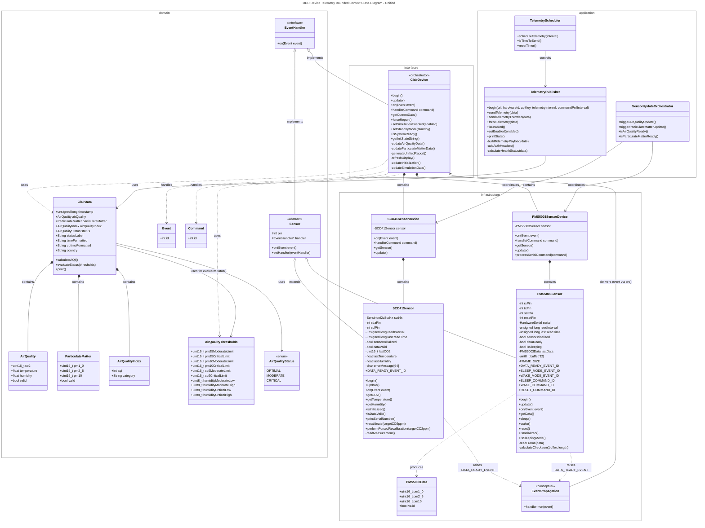
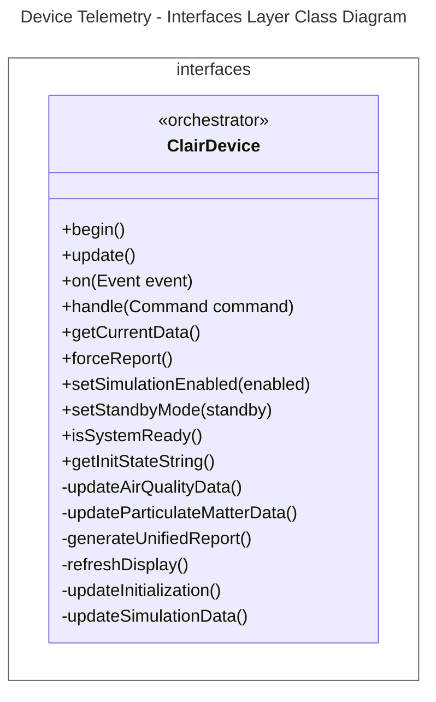
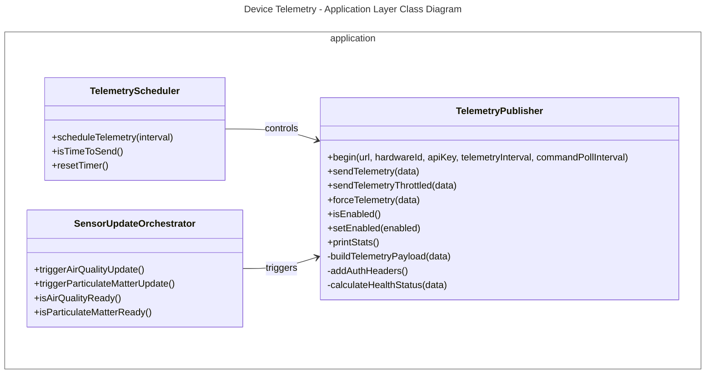
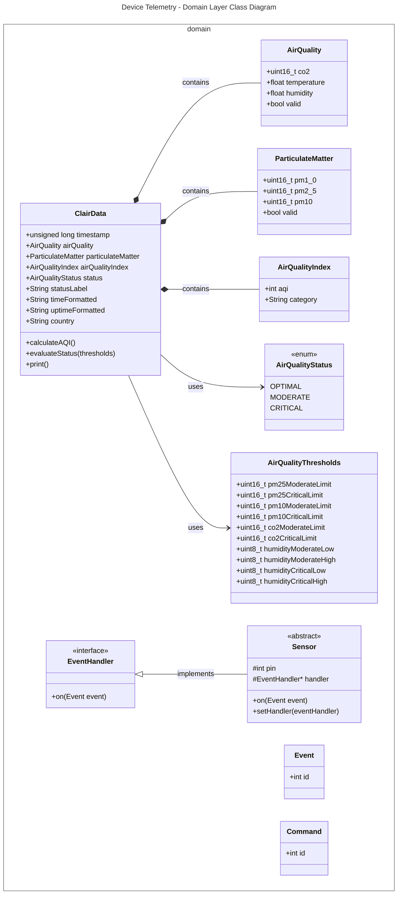
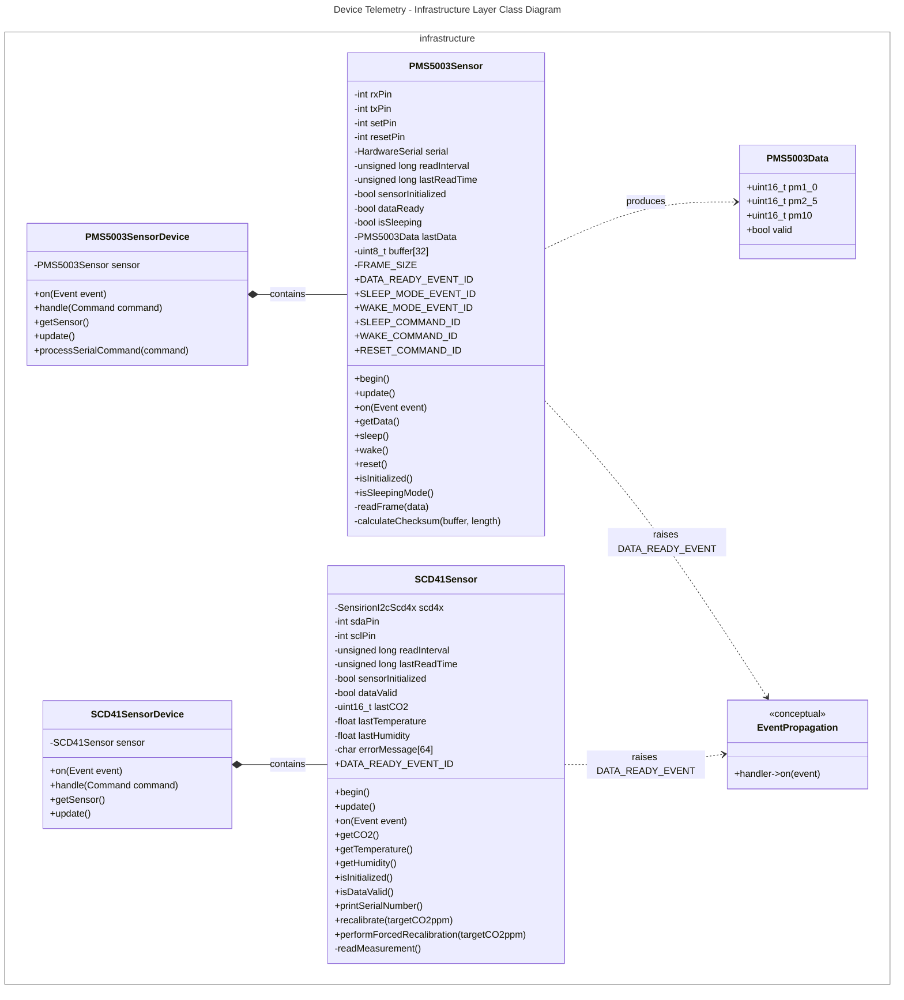
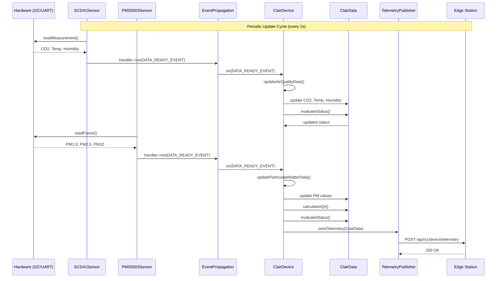

# Device Telemetry Bounded Context Class Diagrams
This document contains the class diagrams of the Device Telemetry Bounded Context in the Embedded application, including the unified view and strictly separated views for each layer (following DDD tactical patterns with ModestIoT framework).

---

## 1. Unified Diagram

## 2. Layer-by-Layer Diagrams

### 2.1. Interfaces Layer

>note for ClairDevice "Main orchestrator implementing\nEventHandler and CommandHandler\nfrom ModestIoT framework"
---

### 2.2. Application Layer

---

### 2.3. Domain Layer

---

## 2.4. Infrastructure Layer

---

## 3. Key Flows
### 3.1. Sensor Data Acquisition Flow

## 4. Telemetry Data Types Summary

| Data Type | Field | Source | Unit | Valid Range |
|-----------|-------|--------|------|-------------|
| **CO2** | `airQuality.co2` | SCD41Sensor | ppm | 400 - 5000 |
| **Temperature** | `airQuality.temperature` | SCD41Sensor | °C | -10 - 60 |
| **Humidity** | `airQuality.humidity` | SCD41Sensor | % | 0 - 100 |
| **PM1.0** | `particulateMatter.pm1_0` | PMS5003Sensor | µg/m³ | 0 - 1000 |
| **PM2.5** | `particulateMatter.pm2_5` | PMS5003Sensor | µg/m³ | 0 - 1000 |
| **PM10** | `particulateMatter.pm10` | PMS5003Sensor | µg/m³ | 0 - 1000 |
| **AQI** | `airQualityIndex.aqi` | Calculated from PM2.5 | index | 0 - 500 |
| **AQI Category** | `airQualityIndex.category` | Calculated from AQI | string | Good, Moderate, Unhealthy for Sensitive, Unhealthy, Very Unhealthy, Hazardous |
| **Status** | `status` | Evaluated from all sensors | enum | OPTIMAL, MODERATE, CRITICAL |
| **Status Label** | `statusLabel` | Evaluated from status | string | Optimal, Moderate, Critical |
| **Timestamp** | `timestamp` | millis() | ms | 0 - 2^32-1 |
| **Time Formatted** | `timeFormatted` | NTP sync | HH:MM:SS | 00:00:00 - 23:59:59 |
| **Uptime Formatted** | `uptimeFormatted` | millis() calculation | HH:MM:SS | 00:00:00 - 99:59:59 |
| **Country** | `country` | Configuration | string | PERU (default) |

### Air Quality Status Evaluation Thresholds

| Parameter | OPTIMAL | MODERATE | CRITICAL |
|-----------|---------|----------|----------|
| **PM2.5 (µg/m³)** | < 35 | 35 - 55 | > 55 |
| **PM10 (µg/m³)** | < 75 | 75 - 150 | > 150 |
| **CO2 (ppm)** | < 1000 | 1000 - 1500 | > 1500 |
| **Humidity (%)** | 30 - 70 | 20 - 30 or 70 - 80 | < 20 or > 80 |

### AQI Calculation (based on PM2.5)

| PM2.5 Range (µg/m³) | AQI Range | Category |
|---------------------|-----------|----------|
| 0 - 12 | 0 - 50 | Good |
| 13 - 35 | 51 - 100 | Moderate |
| 36 - 55 | 101 - 150 | Unhealthy for Sensitive |
| 56 - 150 | 151 - 200 | Unhealthy |
| 151 - 250 | 201 - 300 | Very Unhealthy |
| 251 - 500 | 301 - 500 | Hazardous |

## 5. Bounded Context Summary

| Layer | Components | Responsibility |
|-------|------------|----------------|
| **Interfaces** | `ClairDevice` | Main orchestrator, implements EventHandler, coordinates sensor updates, manages system state (Init/Standby/Normal) |
| **Application** | `TelemetryPublisher` (EdgeService), `TelemetryScheduler`, `SensorUpdateOrchestrator` | Publishes telemetry to Edge via HTTPS, manages send intervals, coordinates sensor read timing |
| **Domain** | `ClairData`, `AirQuality`, `ParticulateMatter`, `AirQualityIndex`, `AirQualityThresholds`, `AirQualityStatus` | Pure business logic: AQI calculation, status evaluation against thresholds, data validation rules |
| **Infrastructure** | `SCD41Sensor`, `PMS5003Sensor`, `SCD41SensorDevice`, `PMS5003SensorDevice`, `EventPropagation` | Hardware communication (I2C for SCD41, UART for PMS5003), event propagation mechanism via handler->on() |
