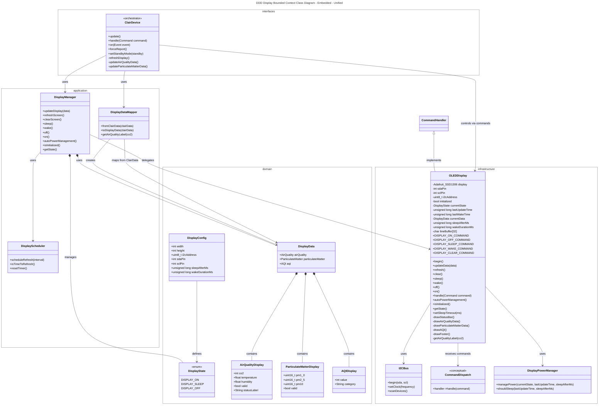
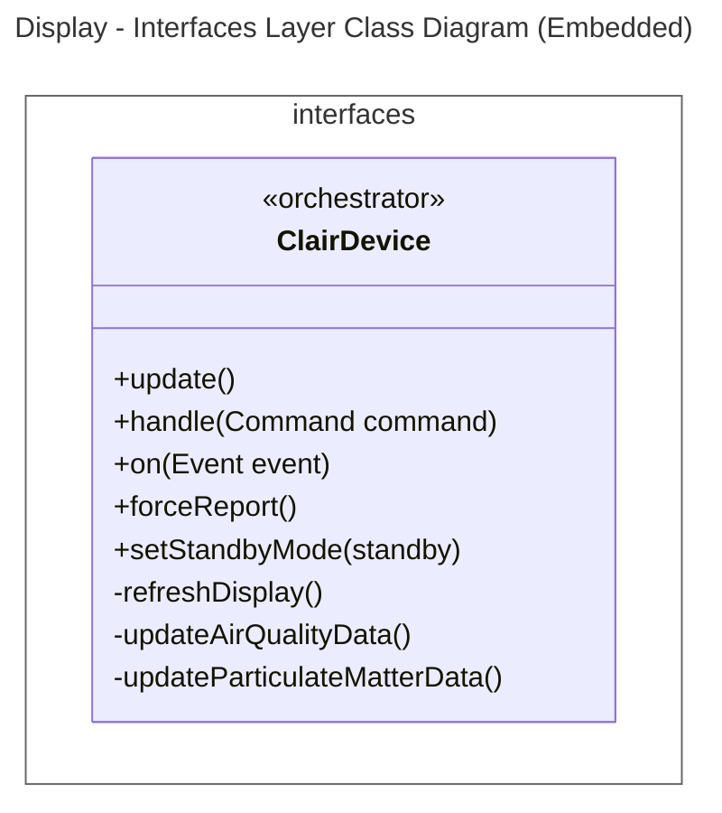
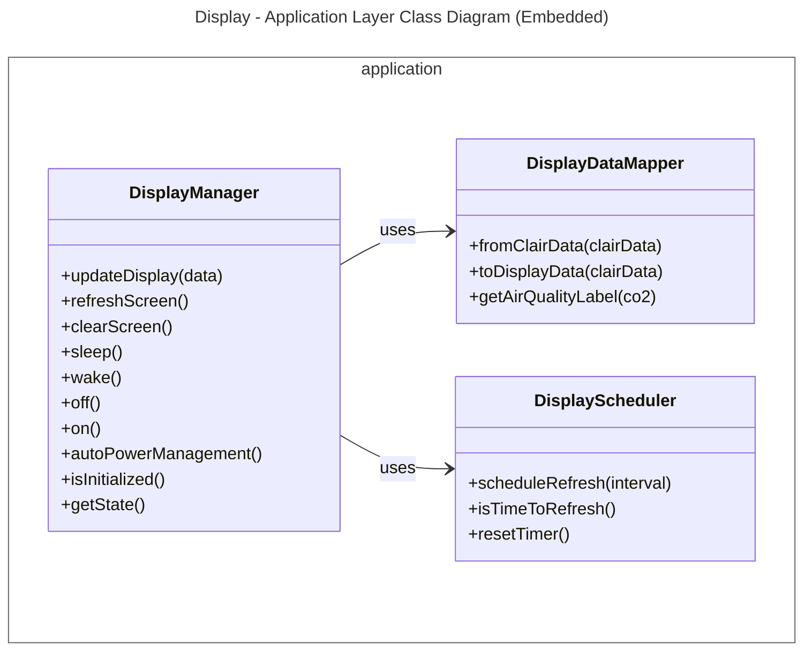
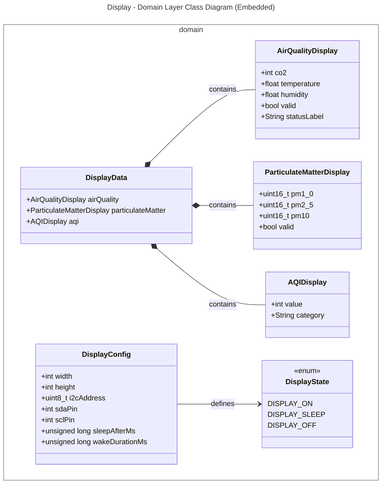
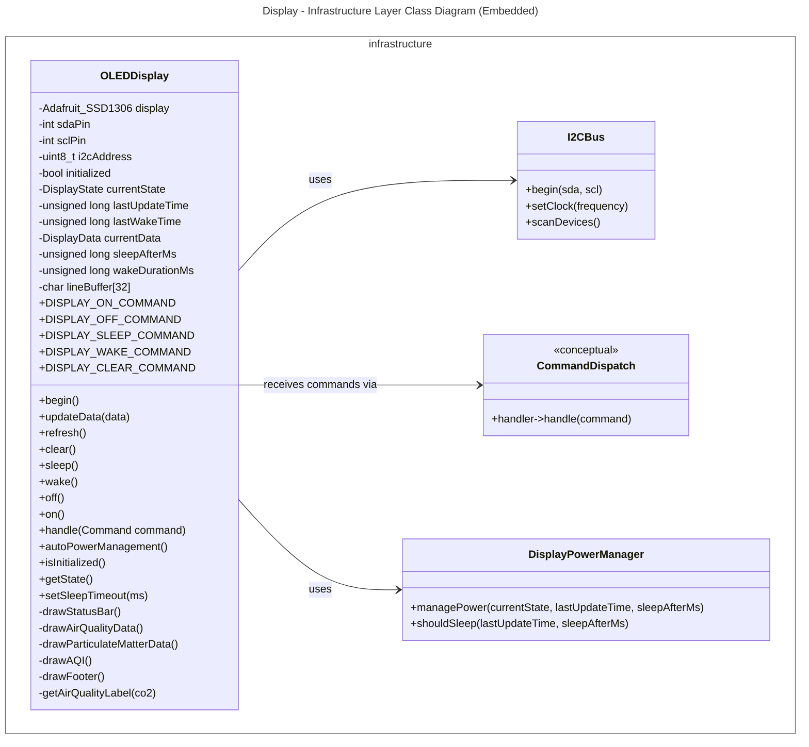
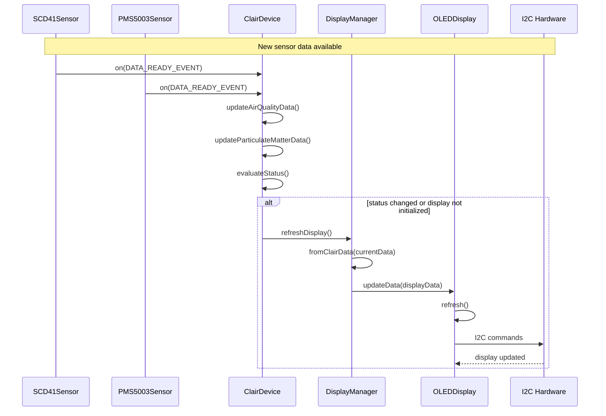
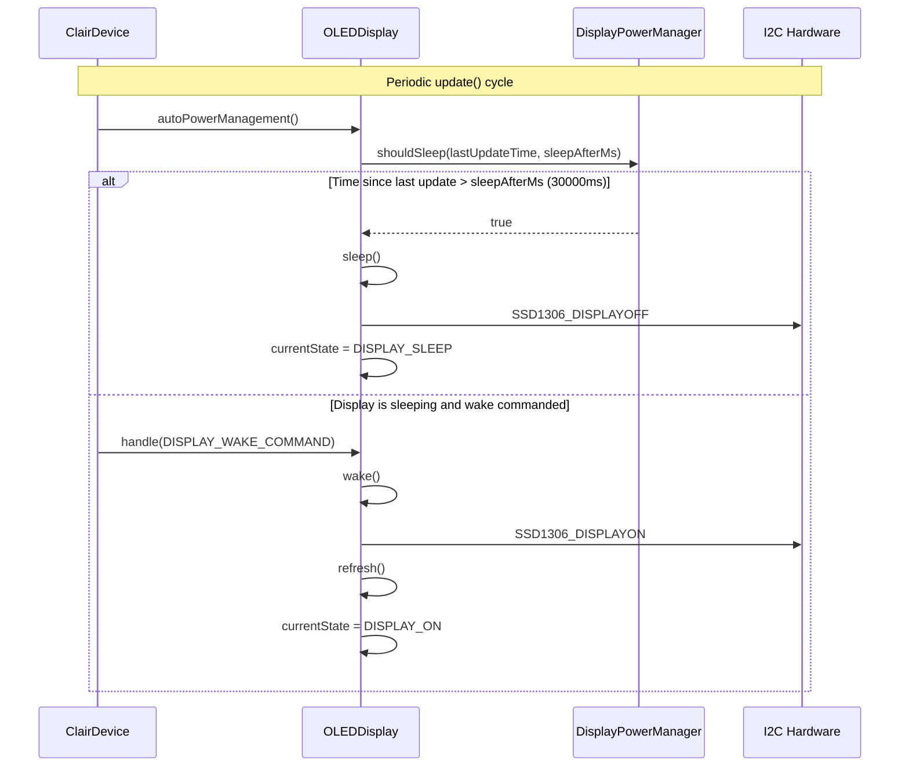
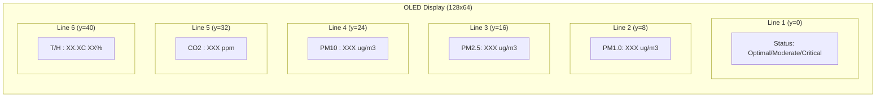

# Display Bounded Context Class Diagrams
This document contains the class diagrams of the Display Bounded Context in the Embedded application, including the unified view and strictly separated views for each layer (following DDD tactical patterns with ModestIoT framework).

---

## 1. Unified Diagram

## 2. Layer-by-Layer Diagrams

### 2.1. Interfaces Layer

>note for ClairDevice "Main orchestrator that:\n- Calls refreshDisplay() when data changes\n- Sends display commands via handle()\n- Triggers display update on status change"
---

### 2.2. Application Layer

---

### 2.3. Domain Layer

---

## 2.4. Infrastructure Layer

---

## 3. Key Flows
### 3.1. Display Update Flow

### 3.2. Display Power Management Flow

### 3.3. Display Content Layout

## 4. Display Configuration Summary

### 4.1. Display Hardware Configuration

| Parameter | Value | Description |
|-----------|-------|-------------|
| `Width` | 128 | Display width in pixels |
| `Height` | 64 | Display height in pixels |
| `I2C Address` | 0x3C | Default SSD1306 I2C address |
| `SDA Pin` | 21 | I2C data pin (default) |
| `SCL Pin` | 22 | I2C clock pin (default) |
| `I2C Clock` | 400000 | I2C bus frequency (400kHz) |

### 4.2. Display Power Management Configuration

| Parameter | Value | Description |
|-----------|-------|-------------|
| `DEFAULT_SLEEP_AFTER_MS` | 30000 | Auto-sleep after inactivity (ms) |
| `DEFAULT_WAKE_DURATION_MS` | 10000 | Duration display stays awake after wake (ms) |
| `DISPLAY_ON` | 0 | Display fully on state |
| `DISPLAY_SLEEP` | 1 | Display sleep (power saving) state |
| `DISPLAY_OFF` | 2 | Display completely off state |

### 4.3. Display Layout Configuration

| Line | Y Position | Content | Format |
|------|------------|---------|--------|
| 1 | 0 | Status Label | "Status: XXXXXXXXX" (commented, not shown) |
| 2 | 8 | PM1.0 | "PM1.0: XXX ug/m3" |
| 3 | 16 | PM2.5 | "PM2.5: XXX ug/m3" |
| 4 | 24 | PM10 | "PM10 : XXX ug/m3" |
| 5 | 32 | CO2 | "CO2  : XXX ppm" |
| 6 | 40 | Temperature/Humidity | "T/H  : XX.XC XX%" |

### 4.4. Display Commands Summary

| Command | Command ID | Effect |
|---------|------------|--------|
| `DISPLAY_ON_COMMAND` | 400 | Turns display on |
| `DISPLAY_OFF_COMMAND` | 401 | Turns display off completely |
| `DISPLAY_SLEEP_COMMAND` | 402 | Puts display in sleep mode |
| `DISPLAY_WAKE_COMMAND` | 403 | Wakes display from sleep |
| `DISPLAY_CLEAR_COMMAND` | 404 | Clears display |

### 4.5. Display States Transition

| From State | Event | To State | Action |
|------------|-------|----------|--------|
| DISPLAY_OFF | `DISPLAY_ON_COMMAND` | DISPLAY_ON | Initialize I2C, refresh content |
| DISPLAY_ON | `DISPLAY_OFF_COMMAND` | DISPLAY_OFF | SSD1306_DISPLAYOFF |
| DISPLAY_ON | `DISPLAY_SLEEP_COMMAND` | DISPLAY_SLEEP | SSD1306_DISPLAYOFF |
| DISPLAY_SLEEP | `DISPLAY_WAKE_COMMAND` | DISPLAY_ON | SSD1306_DISPLAYON, refresh |
| DISPLAY_ON | auto timeout (30s) | DISPLAY_SLEEP | Auto-sleep after inactivity |

### 4.6. Display Text Formatting

| Element | Font Size | Line Height | Notes |
|---------|-----------|-------------|-------|
| Text size | 1 (smallest) | 8 pixels | Adafruit_SSD1306 default |
| Status label | 1 | 8 pixels | Currently commented out in code |
| PM values | 1 | 8 pixels | Shows "--" when invalid |
| CO2 values | 1 | 8 pixels | Shows "--" when invalid |
| Temperature/Humidity | 1 | 8 pixels | 1 decimal for temp, 0 for humidity |

## 5. Bounded Context Summary

| Layer | Components | Responsibility |
|-------|------------|----------------|
| **Interfaces** | `ClairDevice` | Main orchestrator that calls refreshDisplay() when status changes or display not initialized, sends display commands via handle() |
| **Application** | `DisplayManager`, `DisplayDataMapper`, `DisplayScheduler` | Manages display updates, maps ClairData to DisplayData, schedules periodic refresh |
| **Domain** | `DisplayData`, `DisplayState` (enum), `DisplayConfig`, `AirQualityDisplay`, `ParticulateMatterDisplay`, `AQIDisplay` | Pure data structures for display content, display state abstractions, configuration values |
| **Infrastructure** | `OLEDDisplay`, `I2CBus`, `CommandDispatch`, `DisplayPowerManager` | Hardware communication via I2C, command handling, power management (auto-sleep after 30s), display rendering |

## 6. Display Configuration Constants

| Constant | Value | Description |
|----------|-------|-------------|
| `DEFAULT_SLEEP_AFTER_MS` | 30000 | Auto-sleep after inactivity (ms) |
| `DEFAULT_WAKE_DURATION_MS` | 10000 | Duration display stays awake after wake (ms) |
| `DISPLAY_WIDTH` | 128 | Display width in pixels |
| `DISPLAY_HEIGHT` | 64 | Display height in pixels |
| `DEFAULT_I2C_ADDRESS` | 0x3C | Default SSD1306 I2C address |
| `DEFAULT_SDA_PIN` | 21 | Default I2C SDA pin |
| `DEFAULT_SCL_PIN` | 22 | Default I2C SCL pin |
| `I2C_CLOCK_FREQUENCY` | 400000 | I2C bus frequency (Hz) |
| `TEXT_SIZE` | 1 | Font size (smallest) |
| `LINE_HEIGHT` | 8 | Pixels per line |

## 7. API/Command Endpoints Summary

| Command | Direction | Purpose |
|---------|-----------|---------|
| `DISPLAY_ON_COMMAND` | Device → Display | Turn display on |
| `DISPLAY_OFF_COMMAND` | Device → Display | Turn display off completely |
| `DISPLAY_SLEEP_COMMAND` | Device → Display | Put display in sleep mode |
| `DISPLAY_WAKE_COMMAND` | Device → Display | Wake display from sleep |
| `DISPLAY_CLEAR_COMMAND` | Device → Display | Clear display content |

> **Note:** All display commands are delivered via the ModestIoT CommandDispatch mechanism (`handler->handle(command)`). The OLEDDisplay implements CommandHandler interface and processes these commands in its `handle()` method.

