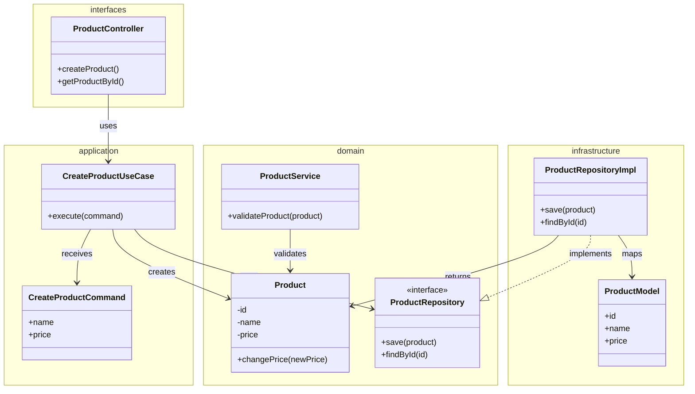

```mermaid
classDiagram

namespace interfaces {
    class ProductController {
        +createProduct()
        +getProductById()
    }
}

namespace application {
    class CreateProductUseCase {
        +execute(command)
    }

    class CreateProductCommand {
        +name
        +price
    }
}

namespace domain {
    class Product {
        -id
        -name
        -price
        +changePrice(newPrice)
    }

    class ProductRepository {
        <<interface>>
        +save(product)
        +findById(id)
    }

    class ProductService {
        +validateProduct(product)
    }
}

namespace infrastructure {
    class ProductRepositoryImpl {
        +save(product)
        +findById(id)
    }

    class ProductModel {
        +id
        +name
        +price
    }
}

ProductController --> CreateProductUseCase : uses
CreateProductUseCase --> CreateProductCommand : receives
CreateProductUseCase --> Product : creates
CreateProductUseCase --> ProductRepository : uses

ProductService --> Product : validates

ProductRepositoryImpl ..|> ProductRepository : implements
ProductRepositoryImpl --> ProductModel : maps
ProductRepositoryImpl --> Product : returns
```

