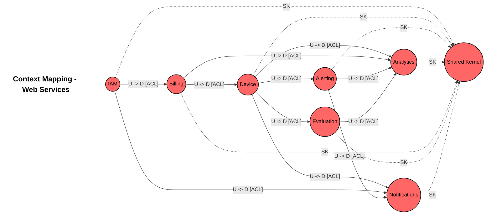

# Context Mapping

This document contains the Context Mapping diagram for the Web Services.

## Context Mapping Diagram

```mermaid
flowchart LR
    %% Context Mapping - Web Services

    title["Context Mapping - Web Services"]

    IAM(("IAM"))
    Device(("Device"))
    Alerting(("Alerting"))
    Analytics(("Analytics"))
    Billing(("Billing"))
    Evaluation(("Evaluation"))
    Notifications(("Notifications"))
    Shared(("Shared Kernel"))

    %% Upstream -> Downstream relationships with ACL
    Device -->|"U -> D [ACL]"| Alerting
    Device -->|"U -> D [ACL]"| Analytics
    Device -->|"U -> D [ACL]"| Evaluation
    Device -->|"U -> D [ACL]"| Notifications

    Billing -->|"U -> D [ACL]"| Device
    Billing -->|"U -> D [ACL]"| Analytics

    Alerting -->|"U -> D [ACL]"| Analytics
    Evaluation -->|"U -> D [ACL]"| Analytics

    IAM -->|"U -> D [ACL]"| Billing
    IAM -->|"U -> D [ACL]"| Notifications
    Alerting -->|"U -> D [ACL]"| Notifications

    %% Shared Kernel Dependencies
    IAM -.->|"SK"| Shared
    Device -.->|"SK"| Shared
    Alerting -.->|"SK"| Shared
    Analytics -.->|"SK"| Shared
    Billing -.->|"SK"| Shared
    Evaluation -.->|"SK"| Shared
    Notifications -.->|"SK"| Shared

    title ~~~ IAM

    classDef context fill:#ff6666,stroke:#000,stroke-width:1.5px,color:#000;
    classDef titleNode fill:transparent,stroke:transparent,color:#000,font-size:22px,font-weight:bold;

    class IAM,Device,Alerting,Analytics,Billing,Evaluation,Notifications,Shared context;
    class title titleNode;
```
