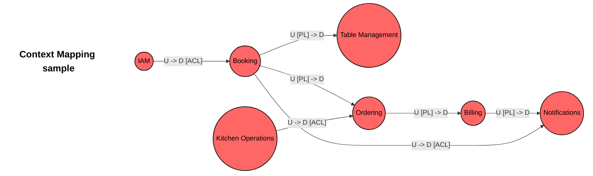

```mermaid
flowchart LR
    %% Context Mapping sample - Restaurant domain

    title["Context Mapping sample"]

    IAM(("IAM"))
    Booking(("Booking"))
    Tables(("Table Management"))
    Ordering(("Ordering"))
    Kitchen(("Kitchen Operations"))
    Billing(("Billing"))
    Notifications(("Notifications"))

    IAM -->|"U -> D [ACL]"| Booking
    Booking -->|"U [PL] -> D"| Tables
    Booking -->|"U [PL] -> D"| Ordering

    Kitchen -->|"U -> D [ACL]"| Ordering
    Ordering -->|"U [PL] -> D"| Billing

    Billing -->|"U [PL] -> D"| Notifications
    Booking -->|"U -> D [ACL]"| Notifications

    title ~~~ IAM

    classDef context fill:#ff6666,stroke:#000,stroke-width:1.5px,color:#000;
    classDef titleNode fill:transparent,stroke:transparent,color:#000,font-size:22px,font-weight:bold;

    class IAM,Booking,Tables,Ordering,Kitchen,Billing,Notifications context;
    class title titleNode;
```