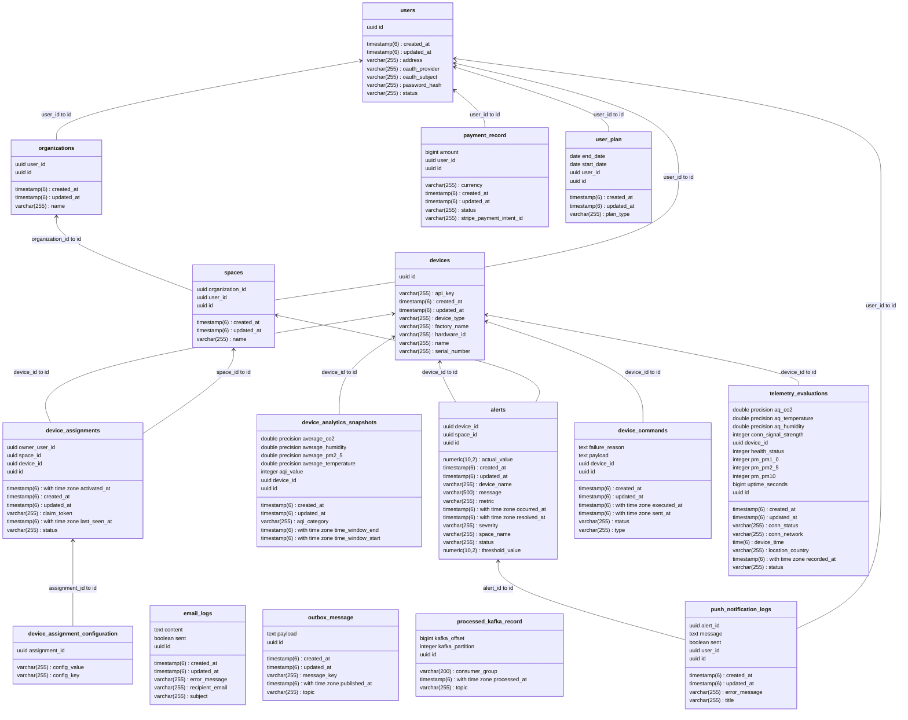

```mermaid
classDiagram
direction BT
class alerts {
   numeric(10,2) actual_value
   timestamp(6) created_at
   timestamp(6) updated_at
   uuid device_id
   varchar(255) device_name
   varchar(500) message
   varchar(255) metric
   timestamp(6) with time zone occurred_at
   timestamp(6) with time zone resolved_at
   varchar(255) severity
   uuid space_id
   varchar(255) space_name
   varchar(255) status
   numeric(10,2) threshold_value
   uuid id
}
class device_analytics_snapshots {
   timestamp(6) created_at
   timestamp(6) updated_at
   double precision average_co2
   double precision average_humidity
   double precision average_pm2_5
   double precision average_temperature
   integer aqi_value
   varchar(255) aqi_category
   uuid device_id
   timestamp(6) with time zone time_window_end
   timestamp(6) with time zone time_window_start
   uuid id
}
class device_assignment_configuration {
   varchar(255) config_value
   uuid assignment_id
   varchar(255) config_key
}
class device_assignments {
   timestamp(6) with time zone activated_at
   timestamp(6) created_at
   timestamp(6) updated_at
   varchar(255) claim_token
   timestamp(6) with time zone last_seen_at
   uuid owner_user_id
   uuid space_id
   varchar(255) status
   uuid device_id
   uuid id
}
class device_commands {
   timestamp(6) created_at
   timestamp(6) updated_at
   timestamp(6) with time zone executed_at
   text failure_reason
   text payload
   timestamp(6) with time zone sent_at
   varchar(255) status
   varchar(255) type
   uuid device_id
   uuid id
}
class devices {
   varchar(255) api_key
   timestamp(6) created_at
   timestamp(6) updated_at
   varchar(255) device_type
   varchar(255) factory_name
   varchar(255) hardware_id
   varchar(255) name
   varchar(255) serial_number
   uuid id
}
class email_logs {
   timestamp(6) created_at
   timestamp(6) updated_at
   text content
   varchar(255) error_message
   varchar(255) recipient_email
   boolean sent
   varchar(255) subject
   uuid id
}
class organizations {
   timestamp(6) created_at
   timestamp(6) updated_at
   varchar(255) name
   uuid user_id
   uuid id
}
class outbox_message {
   timestamp(6) created_at
   timestamp(6) updated_at
   varchar(255) message_key
   text payload
   timestamp(6) with time zone published_at
   varchar(255) topic
   uuid id
}
class payment_record {
   bigint amount
   varchar(255) currency
   timestamp(6) created_at
   timestamp(6) updated_at
   varchar(255) status
   varchar(255) stripe_payment_intent_id
   uuid user_id
   uuid id
}
class processed_kafka_record {
   varchar(200) consumer_group
   bigint kafka_offset
   integer kafka_partition
   timestamp(6) with time zone processed_at
   varchar(255) topic
   uuid id
}
class push_notification_logs {
   timestamp(6) created_at
   timestamp(6) updated_at
   uuid alert_id
   varchar(255) error_message
   text message
   boolean sent
   varchar(255) title
   uuid user_id
   uuid id
}
class spaces {
   timestamp(6) created_at
   timestamp(6) updated_at
   varchar(255) name
   uuid organization_id
   uuid user_id
   uuid id
}
class telemetry_evaluations {
   double precision aq_co2
   double precision aq_temperature
   double precision aq_humidity
   timestamp(6) created_at
   timestamp(6) updated_at
   varchar(255) conn_status
   varchar(255) conn_network
   integer conn_signal_strength
   uuid device_id
   time(6) device_time
   integer health_status
   varchar(255) location_country
   integer pm_pm1_0
   integer pm_pm2_5
   integer pm_pm10
   timestamp(6) with time zone recorded_at
   varchar(255) status
   bigint uptime_seconds
   uuid id
}
class user_plan {
   timestamp(6) created_at
   timestamp(6) updated_at
   date end_date
   varchar(255) plan_type
   date start_date
   uuid user_id
   uuid id
}
class users {
   timestamp(6) created_at
   timestamp(6) updated_at
   varchar(255) address
   varchar(255) oauth_provider
   varchar(255) oauth_subject
   varchar(255) password_hash
   varchar(255) status
   uuid id
}

alerts --> devices : device_id to id
alerts  -->  spaces : space_id to id
device_analytics_snapshots  -->  devices : device_id to id
device_assignment_configuration  -->  device_assignments : assignment_id to id
device_assignments  -->  devices : device_id to id
device_assignments  -->  spaces : space_id to id
device_commands  -->  devices : device_id to id
organizations  -->  users : user_id to id
payment_record  -->  users : user_id to id
push_notification_logs  -->  alerts : alert_id to id
push_notification_logs  -->  users : user_id to id
spaces  -->  organizations : organization_id to id
spaces  -->  users : user_id to id
telemetry_evaluations  -->  devices : device_id to id
user_plan  -->  users : user_id to id

```